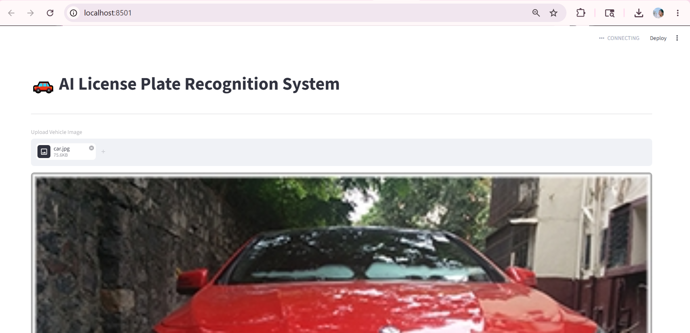
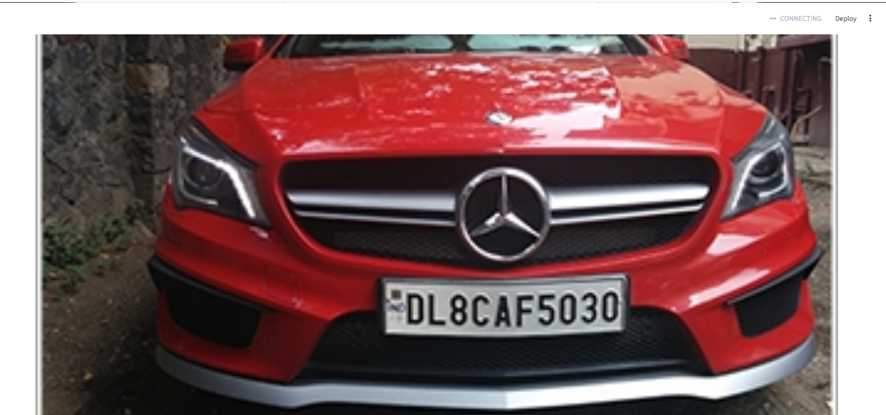
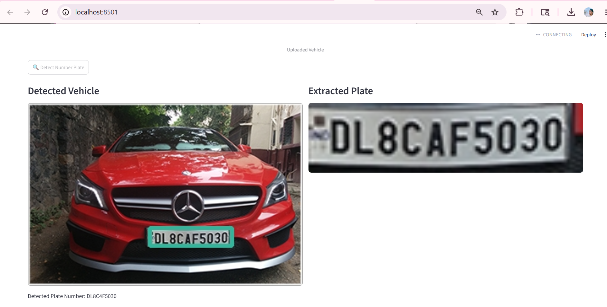
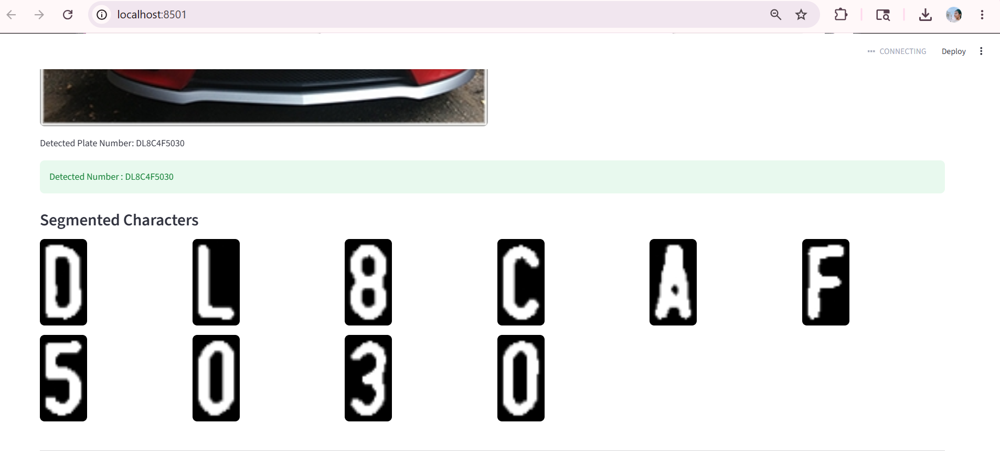

#  License Plate Recognition System

## Overview
Automatic License Plate Recognition System using CNN, OpenCV and Streamlit.

## Features
- Vehicle Image Upload
- License Plate Detection
- Character Segmentation
- CNN OCR Recognition
- Streamlit Dashboard

## Project Outputs

## Tech Stack
- Python
- TensorFlow
- OpenCV
- Streamlit
- NumPy

## Run

pip install -r requirements.txt

streamlit run app.py
